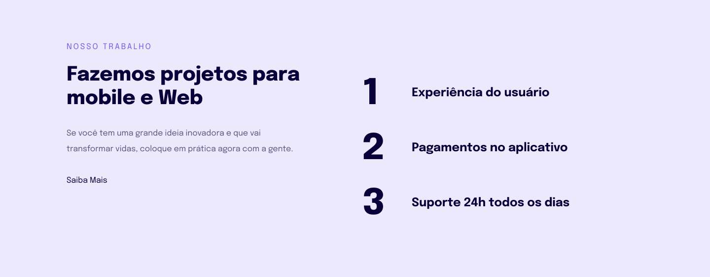
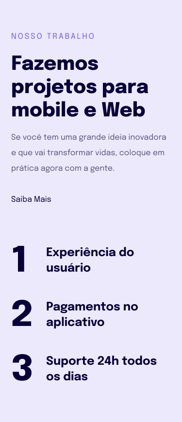

<h1 align="center"> Projeto 03.2 - Página para aplicação de conceitos de responsividade</h1>

Programa exclusivo e gratuito, promovido pela Rocketseat para ensino de tecnologias WEB.

  <a href="#-tecnologias">Tecnologias</a>&nbsp;&nbsp;&nbsp;|&nbsp;&nbsp;&nbsp;
  <a href="#-projeto">Projeto</a>&nbsp;&nbsp;&nbsp;|&nbsp;&nbsp;&nbsp;
  <a href="#-layout">Layout</a>&nbsp;&nbsp;&nbsp;|&nbsp;&nbsp;&nbsp;
  <a href="#memo-licença">Licença</a>

  

 

Versão Desktop:
  
   
   
  Versão Mobile:
   

## 🚀 Tecnologias

Esse projeto foi desenvolvido com as seguintes tecnologias:

- HTML e CSS
- Git e Github
- Figma

## 💻 Projeto

O Site é do tipo espositivo. A página visa aplicar estudos e conceitos de responsividade.

## 🔖 Layout

Você pode visualizar o layout do projeto através [DESSE LINK](<https://www.figma.com/file/k6WvIBuiUuUPpFHvm1Pgtu/Explorer-Stage-03-Projeto-02-(Copy)?node-id=203%3A1745&mode=dev>).
É necessário ter conta no [Figma](https://figma.com) para acessá-lo.

## :memo: Licença

Esse projeto está sob a licença MIT.
Projeto desenvolvido por Leonardo Comandulli através da RocketSeat.

---

